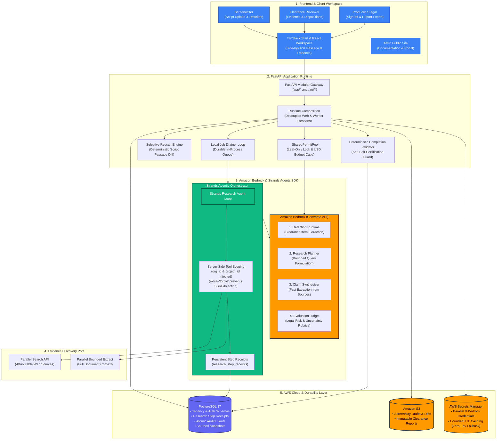

# ClearCut

[](https://opensource.org/licenses/MIT)
[](https://www.python.org/)
[](https://aws.amazon.com/bedrock/)
[](https://strandsagents.com/)

**A screenplay pre-clearance evidence workspace powered by Amazon Bedrock, Strands Agents, and Parallel.**

ClearCut reads screenplay drafts, detects clearance concerns across ten protected categories (trademarks, brands, real people, music, copyrighted works, and more), and autonomously gathers cited, real-world evidence using bounded agentic research loops. It coordinates accountable human review, re-evaluates the script as revisions occur, and produces immutable, audit-ready clearance reports.

> *ClearCut supports factual research and qualified human review. It does not provide legal advice or guarantee legal clearance.*

---

## Architecture



---

## Key Features

1. **Ten Protected Clearance Categories**: Identifies real people, brands, copyrighted works, music, locations, and sensitive contact info.
2. **Amazon Bedrock Model Roles**: Specialized capability adapters for Detection, Research Planning, Claim Synthesis, and Judging using the Converse API with truthful model reflection.
3. **Bounded Strands Agentic Orchestration**: Autonomous research loops using the Strands Agents SDK and Parallel Search/Extract with strict server-side tenant scoping and leaf-only permit locks.
4. **Deterministic Selective Rescan**: Re-evaluates only modified script passages on new drafts, preserving existing verified evidence and human decisions by reference.
5. **Human-in-the-Loop Governance**: Immutable PostgreSQL audit trail where writers cannot approve their own rewrites, ensuring complete production accountability.
6. **Deterministic Completion Validation**: Server-side validation guarantees an agent cannot self-certify completion or clear items without cited evidence.

---

## Quickstart Setup Instructions

### Prerequisites
- Python 3.12+ and [uv](https://docs.astral.sh/uv/)
- Node.js 20+ and [pnpm](https://pnpm.io/)
- Bun (for contract checks)
- Docker Desktop (optional, for local PostgreSQL 17)

### 1. Clone & Install
```bash
git clone https://github.com/captjay98/clearcut-aws.git
cd clearcut-aws

# Install Python backend dependencies
uv sync --all-packages --dev

# Install frontend web dependencies
corepack enable
pnpm install
```

### 2. Configure Environment
Copy the example environment configuration:
```bash
cp .env.example .env
```
Key settings:
```bash
CLEARCUT_DEPLOYMENT_PROFILE=local   # 'local' for dev or 'aws' for hosted AWS
DATABASE_URL=sqlite+aiosqlite:///./clearcut.db
# Optional live provider keys (fail-closed when omitted)
BEDROCK_MODEL_DETECTION=amazon.nova-lite-v1:0
PARALLEL_API_KEY=your_key_here
```

### 3. Run Database Migrations
```bash
uv run alembic upgrade head
```

### 4. Start Local Development
```bash
# Start the FastAPI monolithic backend
uv run uvicorn clearcut.main:app --reload --port 8000

# In a separate terminal, start the web workspace
pnpm --filter clearcut-web dev
```
Open [http://localhost:3000](http://localhost:3000) to view the workspace.

---

## Running the Verification Test Suite

ClearCut includes an extensive automated test suite covering unit, integration, architecture, and browser contracts:

```bash
# Run the complete Python test suite
uv run pytest services/api/tests -q

# Run client contract sync check
pnpm contract:check

# Run linter
uv run ruff check services/api

# Run web unit tests
pnpm --filter clearcut-web test

# Build production container packages
pnpm build
```

---

## License

This project is licensed under the [MIT License](LICENSE).
