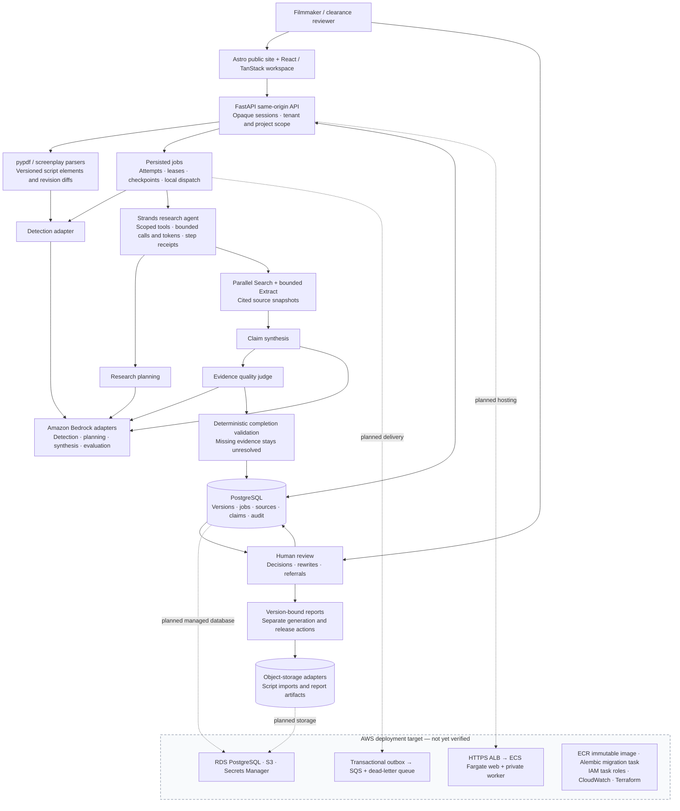

# ClearCut architecture

Screenplay pre-clearance research with accountable human review.

Solid nodes describe application components present in the codebase; they do not claim live-provider verification. The dashed AWS hosting section is the deployment target, not a verified deployment. AWS account suspension currently blocks hosted verification. No OpenRouter fallback is depicted because it has not been implemented or verified here.

## Boundaries

- Gemini/GCP and Bedrock/AWS adapters are separate runtime choices; this diagram focuses on the AWS port.
- Strands coordinates bounded application tools. PostgreSQL remains authoritative for workflow state.
- Parallel Search supplies attributable evidence; Extract adds context. Model output alone is not a source.
- Human decisions and their audit events commit transactionally. AI does not grant clearance.
- AWS deployment services shown in the target section still require provisioning and live acceptance checks.
